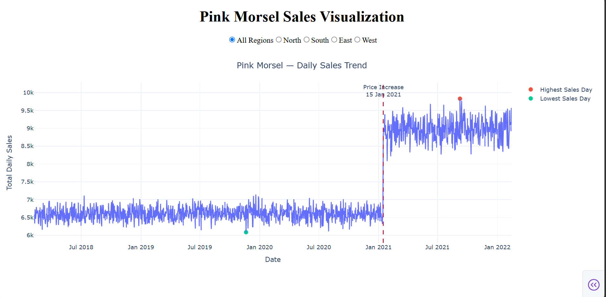
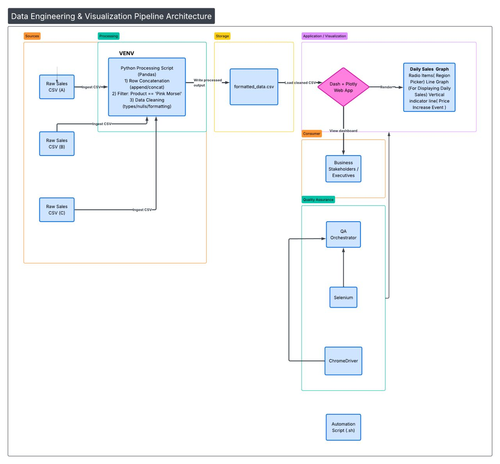
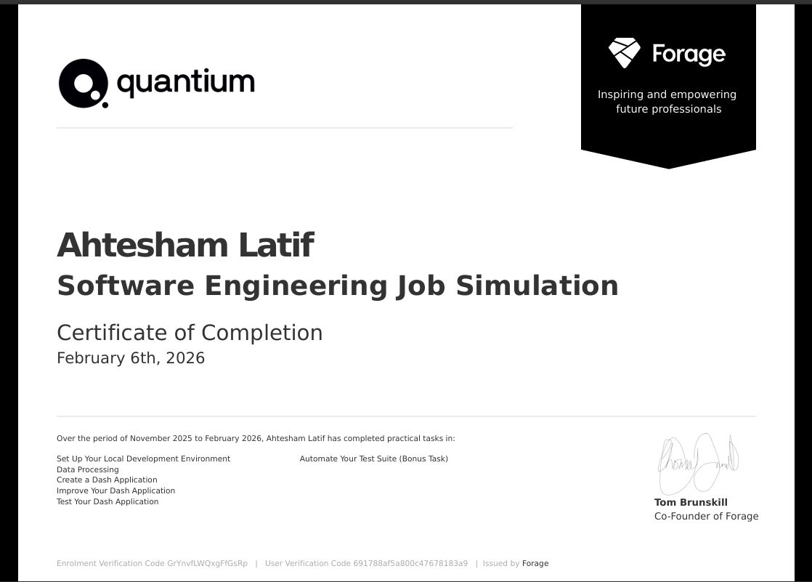

# Pink Morsel Sales Dashboard
> **A full-stack ETL pipeline and interactive web dashboard built to track how a recent price change affected candy sales.**


---

## 👋 Overview: Why I Built This

When a business raises the price of its most popular product, it needs to know right away whether that choice drove profits up or scared customers away. 

I built this project during the **Quantium Software Engineering Job Simulation** on Forage to solve this exact problem for a client named **Soul Foods**. They raised the price of their "Pink Morsel" candy bar on January 15, 2021, but their historical sales data was scattered across fragmented, messy CSV files. 

Instead of crunching the numbers manually, I built an automated pipeline that:
1. **Extracts, transforms, and loads (ETL)** the raw data into a clean, aggregated format using Pandas.
2. **Visualizes** the trends dynamically via a reactive Plotly Dash web app.
3. **Validates** the UI automatically using a Pytest and Selenium headless browser test suite.

---

## 📸 What It Looks Like

### The Dashboard


### How It Works & Certification
| System Flow | Completion Certificate |
| --- | --- |
|  |  |

---

## ✨ Features at a Glance

* **Automated Data Cleaning:** A Python script uses `pandas` to concatenate daily sales files, use regex to strip currency formatting, and calculate gross sales on the fly.
* **Reactive Dashboard:** Built with Plotly Dash, featuring regional radio button callbacks (North, South, East, West) that dynamically update the application state and re-render the graph.
* **Visual Event Markers:** A red dashed line clearly marks the day the price went up, providing instant visual context for pre- and post-hike performance.
* **Automated UI Testing:** I wrote a robust test suite using `pytest` and Selenium that spins up a headless Chrome instance to verify DOM elements and component visibility.
* **CI/CD Ready:** A Bash script (`run_test.sh`) automates the testing environment, catching standard exit codes to seamlessly integrate into continuous integration pipelines.

---

## 🛠️ The Tech Stack

| Tool | Purpose |
| --- | --- |
| **Pandas** | ETL processing, CSV consolidation, and dataframe mutation. |
| **Plotly Dash** | Building the frontend web application and handling reactive callbacks. |
| **Pytest & Selenium** | Headless DOM traversal and component assertion. |
| **Bash** | Automating the test suite for CI environments. |
| **Python** | The core runtime environment. |

---

## 📂 Project Structure

Here is how the project files are organized:

```text
📦 quantium-starter-repo
 ┣ 📂 data/
 ┃ ┣ 📜 daily_sales_data_0.csv
 ┃ ┣ 📜 daily_sales_data_1.csv
 ┃ ┣ 📜 daily_sales_data_2.csv
 ┃ ┗ 📜 pink_morsel_sales.csv     # The cleaned and aggregated artifact
 ┣ 📂 venv/                       # Isolated Python environment
 ┣ 📜 App.ipynb                   # Jupyter notebook for initial exploration
 ┣ 📜 Certificate.png             # Official program certificate
 ┣ 📜 DashBoard.png               # Screenshot of the working UI
 ┣ 📜 FlowDiagram.png             # System architecture diagram
 ┣ 📜 app.py                      # The ETL processing script
 ┣ 📜 task3.py                    # The Dash application server
 ┣ 📜 test_app.py                 # The automated Pytest suite
 ┣ 📜 conftest.py                 # WebDriver and headless browser hooks
 ┣ 📜 run_test.sh                 # CI automation script
 ┣ 📜 Documentation.md            # A detailed step-by-step of my process
 ┣ 📜 README.md                   # You are here!
 ┗ 📜 requirements.txt            # Project dependencies
```

---

## 🚀 How to Run It Yourself

### 1. Clone & Setup
```bash
git clone https://github.com/Ahtesham-Latif/Quantium_job_simulation.git
cd Quantium_job_simulation
python -m venv venv
```

### 2. Activate & Install
```bash
# Windows
venv\Scripts\activate
pip install -r requirements.txt
```

### 3. Run the Pipeline
```bash
# 1. Execute the ETL script to clean the data
python app.py

# 2. Spin up the local dev server (http://127.0.0.1:8050)
python task3.py
```

### 4. Run the Tests
```bash
chmod +x run_test.sh
./run_test.sh
```

---

## 📚 Want to Know More?

If you want a deeper look at exactly how I architected this step-by-step, check out my full documentation:

👉 **[Read Documentation.md](./Documentation.md)**

---

## 👋 About Me

**Ahtesham Latif**  
*Business & IT Student — University of the Punjab (IBIT)*  

**Find me on LinkedIn:** [ahtesham-latif](https://linkedin.com/in/ahtesham-latif)
